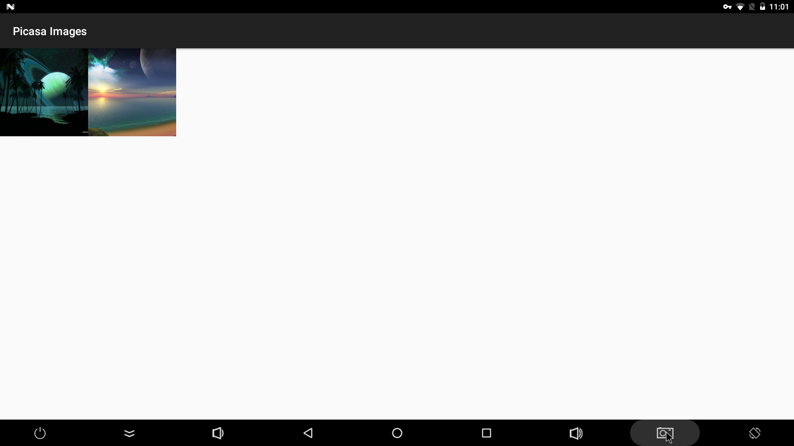

# Gallery Sample for Android
This is an Android demo project that downloads and displays pictures from a public Picasa web album RSS url. While not of much use since Picasa is now deprecated, this Android project demonstrates some core concepts in Android including threads, fragment, service, content provider, broadcast receiver and so on. 

You can modify the RSS url in PhotoThumbnailFragment.java and feed fields in RSSPullParser.java to adapt the app with other image hosting sites that support RSS. The project is built with Android Studio 3.1.3 and should get imported smoothly on Android Studio 3.1+ .

Note that this project is modified from [https://developer.android.com/training/multiple-threads/define-runnable](https://developer.android.com/training/multiple-threads/define-runnable)

